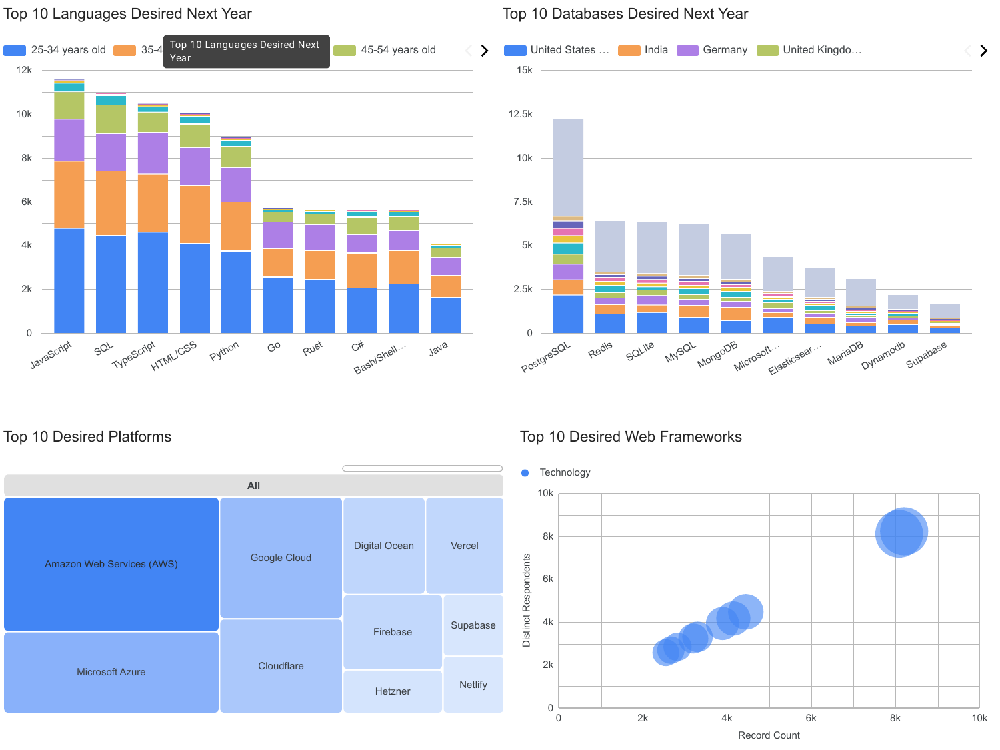

# IBM Data Analyst Capstone Project

## Stack Overflow Developer Survey — Technology Trends & Demographics


An end-to-end data analytics project completed as part of the **IBM Data Analyst Professional Certificate**.

This project analyzes Stack Overflow Developer Survey data to identify trends in programming languages, databases, technology platforms, web frameworks, developer demographics, and compensation.

---

## Project Objective

The objective of this project was to analyze developer survey data and answer questions about current technology usage, future technology preferences, developer demographics, and compensation.

The project follows an end-to-end data analytics workflow:

**Data Collection → Data Wrangling → Exploratory Data Analysis → Statistical Analysis → Data Visualization → Dashboard → Insights**

---

## Business Questions

The analysis focuses on questions such as:

- Which programming languages are currently most widely used?
- Which programming languages are expected to become more popular?
- Which database technologies are most commonly used?
- Which databases show stronger future interest?
- Which technology platforms and web frameworks are most popular?
- How does technology demand vary across locations?
- How do salaries vary across programming languages?
- What are the major demographic characteristics of developers?

---

## Data Sources

### Stack Overflow Developer Survey

The primary dataset contains information about developers, including:

- Programming languages
- Databases
- Platforms
- Web frameworks
- Developer demographics
- Education
- Employment
- Salary and compensation

### Job Posting Data

Additional job-related data was collected using an API to investigate employment demand across locations.

---

## Tools & Technologies

| Category | Technologies |
|---|---|
| Programming | Python |
| Data Analysis | Pandas, NumPy |
| Visualization | Matplotlib, Seaborn |
| Development | Jupyter Notebook |
| Data Collection | APIs, Web Scraping |
| Dashboard | Google Data Studio / Looker Studio |
| Analysis | Exploratory Data Analysis, Correlation Analysis |

---

## Project Workflow

### 1. Data Collection

Data was collected from the Stack Overflow Developer Survey and additional job-posting data using APIs and web scraping.

### 2. Data Wrangling

The datasets were prepared for analysis through:

- Dataset exploration
- Duplicate detection and removal
- Missing-value analysis
- Missing-value handling
- Data normalization
- Data transformation

### 3. Exploratory Data Analysis

The project investigated distributions, outliers, relationships, technology preferences, developer characteristics, and job-market information.

### 4. Statistical Analysis

Correlation analysis was performed to investigate relationships between relevant variables.

### 5. Data Visualization

The analysis used multiple visualization techniques, including:

- Bar charts
- Line charts
- Histograms
- Box plots
- Scatter plots
- Bubble charts
- Pie charts
- Stacked charts

## Dashboard

The project includes a dashboard created using **Google Data Studio (Looker Studio)**.

[View Dashboard Report](dashboards/stackoverflow_technology_trends_dashboard.pdf)
---

# Key Findings

## Programming Languages

JavaScript remained one of the most prominent programming languages in the analyzed developer data.

Python, SQL, and HTML/CSS were also among the widely used technologies.

The future-preference analysis showed increased interest in technologies such as TypeScript, Go, and Rust.

---

## Database Technologies

PostgreSQL ranked strongly in both current usage and future preferences.

Redis showed a notable increase in future preference compared with its current ranking.

Supabase also appeared among technologies gaining future interest.

---

## Job Market

The job-posting analysis showed differences in technology-related job demand across locations.

The project also examined salary differences associated with programming languages.

---

## Developer Demographics

The analysis examined:

- Age
- Education
- Geographic distribution
- Employment characteristics

The largest concentration of respondents was in the 25–44 age range.

---

# Project Structure

```text
ibm-data-analyst-capstone-project/
│
├── dashboards/
│   ├── README.md
│   └── Stack_Overflow_Developer_Survey_-_Technology_Trends_&_Demographics (2).pdf
│
├── notebooks/
│   ├── README.md
│   ├── 01_explore_dataset.ipynb
│   ├── 02_data_wrangling.ipynb
│   ├── 03_collect_job_data_api.ipynb
│   ├── 04_web_scraping.ipynb
│   ├── 05_exploratory_data_analysis.ipynb
│   ├── 06_correlation_analysis.ipynb
│   └── 07_data_visualization.ipynb
│
├── report/
│   ├── README.md
│   └── Data Analyst Capstone Report.pdf
│
└── README.md

```

## Skills Demonstrated

- Data Collection
- Data Cleaning
- Data Wrangling
- Exploratory Data Analysis
- Statistical Analysis
- Python
- Pandas
- NumPy
- Data Visualization
- API Data Collection
- Web Scraping
- Dashboard Development
- Data Storytelling
- Business Insight Generation

## Project Deliverables

- Python/Jupyter analysis notebooks
- Data collection notebooks
- Exploratory data analysis
- Visualization analysis
- Interactive dashboard/report
- Final capstone report

## Certification

**IBM Data Analyst Professional Certificate**

## Author

**Dhruv verma**

Aspiring Data Analyst
